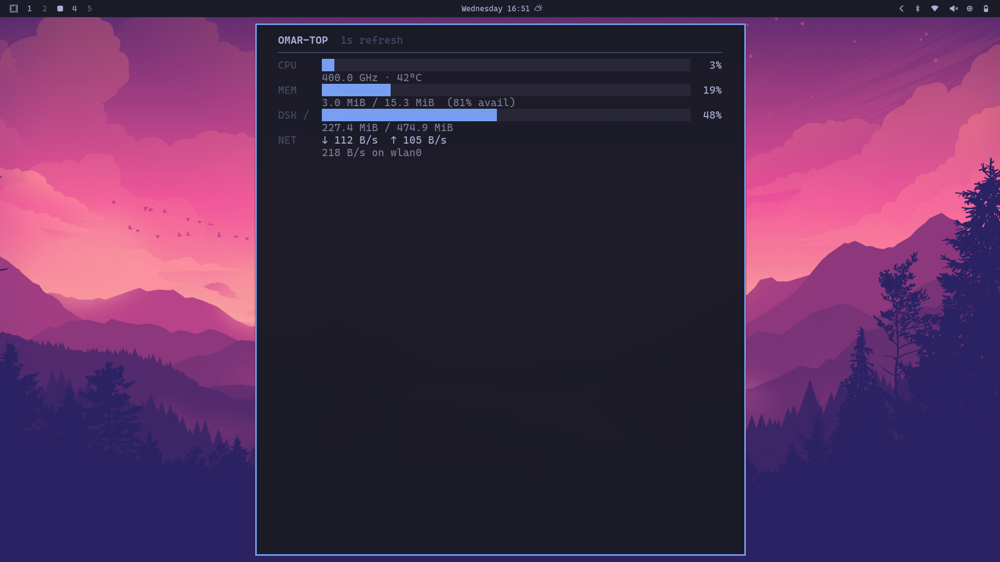

# OMAR-TOP



A lightweight TUI resource monitor for Linux, built with Go and Bubble Tea. Designed for [Omarchy](https://omarchy.org/) — automatically follows the active Omarchy theme colors.

## Features

- **CPU** — usage %, frequency, temperature
- **GPU** — auto-detects NVIDIA (nvidia-smi), AMD, and Intel; usage + temp + VRAM
- **Memory** — used / total with available %
- **Disk** — physical filesystem usage
- **Network** — real-time down/up speeds (MB/s)
- **Omarchy theme integration** — colors match the current desktop theme, updates live on theme change

## Installation

```bash
git clone https://github.com/ikpvk/omar_top.git
cd omar_top
go build -o ~/.local/bin/omar_top .
```

## Usage

```bash
omar_top
```

`q` / `esc` / `ctrl+c` — quit

## Omarchy Theme Integration

OMAR-TOP uses the same theme mechanism as btop. A template at `~/.config/omarchy/themed/omar_top.theme.tpl` maps Omarchy's `colors.toml` to the app's color slots. When you run `omarchy theme set "Name"`, the template is rendered and colors update live.

A symlink `~/.config/omar_top/themes/current.theme` → `~/.config/omarchy/current/theme/omar_top.theme` connects the app to the current theme. The app also handles `SIGUSR2` for live reload.

## Configuration

`~/.config/omar_top/config.toml`:

```toml
color_theme = "current"
update_ms = 1000
theme_background = true
```

## License

MIT
